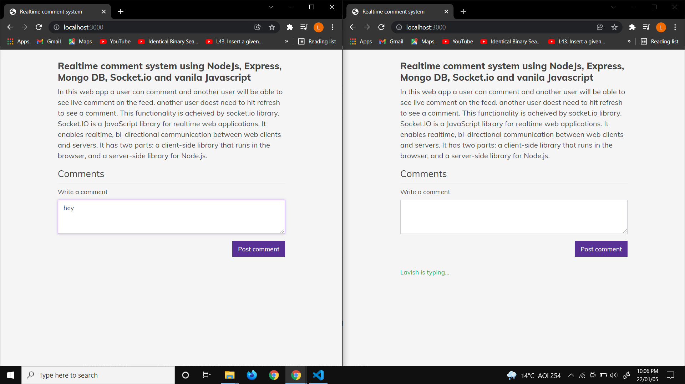
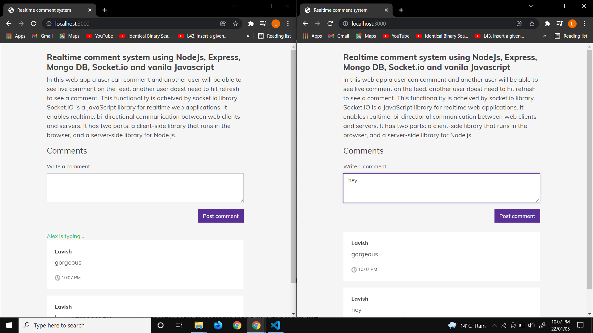

# realtime-comment-system
This project is built using NodeJs, Express, Mongo DB, Socket.io and vanila Javascript🚀

## Installation 
After clone run `npm install` to install all the dependancies and hit "yarn start or npm start".

## Pictures

 

